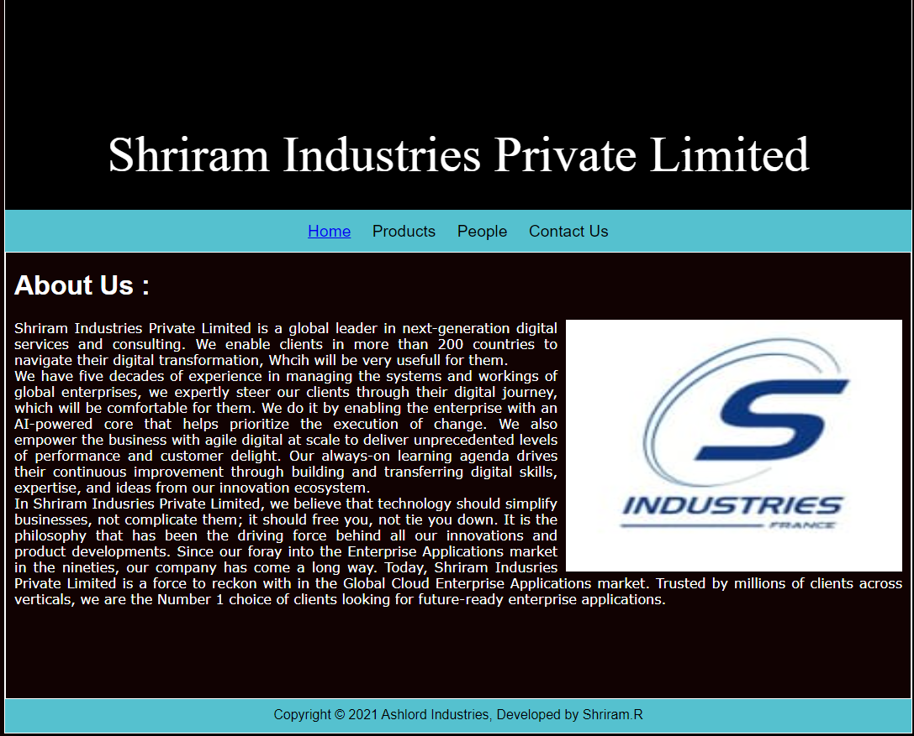
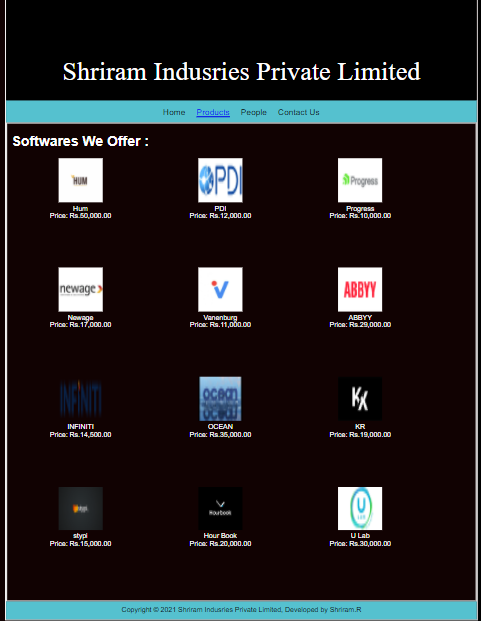
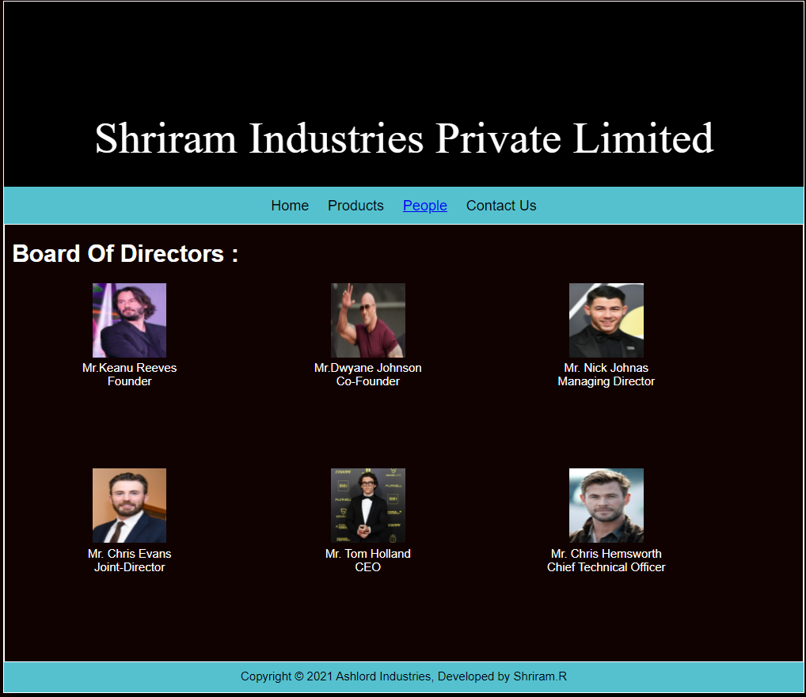
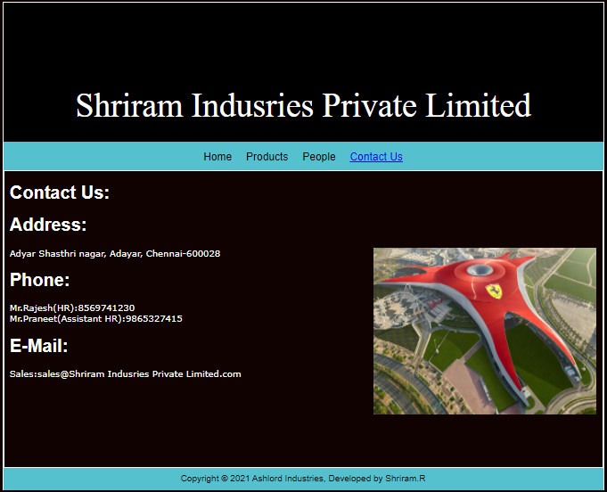

# Web Design for a Software Product Company

## AIM:

To design a static website for a software product company company.

## DESIGN STEPS:

### Step 1:

Requirement collection.

### Step 2:

Creating the layout using HTML and CSS.

### Step 3:

Updating the sample content.

### Step 4:

Choose the appropriate style and color scheme.

### Step 5:

Validate the layout in various browsers.

### Step 6:

Validate the HTML code.

### Step 6:

Publish the website in the given URL.

## PROGRAM :

### Home Page:

~~~
<!DOCTYPE html>
<html lang="en">
  <head>
    <title>Shriram Indusries Private Limited</title>
    <link rel="stylesheet" href="./css/layout.css" />
    <link rel="icon" href="./img/ail.png" type="image/x-icon" />
  </head>

  <body>
    

      
Shriram Industries Private Limited 

      

        
<a href="/static/home.html">Home</a>

        
<a href="/static/products.html">Products</a>

        
<a href="/static/people.html">People</a>

        
<a href="/static/contactus.html">Contact Us</a>

      

      

        

          <h1>About Us :</h1>
          
          

            Shriram Industries Private Limited is a global leader in next-generation digital services and consulting. We enable 
            clients in more than 200 countries to navigate their digital transformation, Whcih will be very usefull for them.
             
            We have five decades of experience in managing the systems and workings of global enterprises, 
            we expertly steer our clients through their digital journey, which will be comfortable for them. We do it by enabling the enterprise 
            with an AI-powered core that helps prioritize the execution of change. We also empower the business 
            with agile digital at scale to deliver unprecedented levels of performance and customer delight. Our 
            always-on learning agenda drives their continuous improvement through building and transferring digital skills, 
            expertise, and ideas from our innovation ecosystem.

             
            In Shriram Indusries Private Limited, we believe that technology should simplify businesses, not complicate them;
             it should free you, not tie you down. It is the philosophy that has been the driving force behind all our
              innovations and product developments. Since our foray into the Enterprise Applications market in the nineties, 
              our company has come a long way. Today, Shriram Indusries Private Limited is a force to reckon with in the Global Cloud Enterprise 
              Applications market. Trusted by millions of clients across verticals, we are the Number 1 choice of clients looking for 
              future-ready enterprise applications.
          

        

      

      

        Copyright &#169; 2021 Ashlord Industries, Developed by Shriram.R
      

    

  </body>
</html>
~~~

### Product Page:

~~~
<!DOCTYPE html>
<html lang="en">
  <head>
    <title>Shriram Indusries Private Limited</title>
    <link rel="stylesheet" href="./css/layout.css" />
    <link rel="icon" href="./img/ail.png" type="image/x-icon" />
  </head>

  <body>
    

      
Shriram Indusries Private Limited

      

        
<a href="/static/home.html">Home</a>

        

          <a href="/static/products.html">Products</a>
        

        
<a href="/static/people.html">People</a>

        
<a href="/static/contactus.html">Contact Us</a>

      

      

        
    
          <h1>Softwares We Offer :</h1>
          

              
 
                  

                  
                  

                  
Hum

                  
Price: Rs.50,000.00 

              

              
 
                  

                  
                  

                  
PDI

                  
Price: Rs.12,000.00 

              

              
 
                  

                  
                  

                  
Progress

                  
Price: Rs.10,000.00 

              

              
 
                  

                  
                  

                  
Newage

                  
Price: Rs.17,000.00 

              

              
 
                  

                  
                  

                  
Vanenburg

                  
Price: Rs.11,000.00 

              

              
 
                  

                  
                  

                  
ABBYY

                  
Price: Rs.29,000.00 

              

              
 
                  

                  
                  

                  
INFINITI

                  
Price: Rs.14,500.00 

              

              
 
                  

                  
                  

                  
OCEAN

                  
Price: Rs.35,000.00 

              

              
 
                  

                  
                  

                  
KR

                  
Price: Rs.19,000.00 

              

              
 
                  

                  
                  

                  
stypi

                  
Price: Rs.15,000.00 

              

              
 
                  

                  
                  

                  
Hour Book

                  
Price: Rs.20,000.00 

              

              
 
                  

                  
                  

                  
U Lab

                  
Price: Rs.30,000.00 

              

          

          
        
      

      

        Copyright &#169; 2021 Shriram Indusries Private Limited, Developed by Shriram.R
      

    

  </body>
</html>
~~~

### People Page: 

~~~
<!DOCTYPE html>
<html lang="en">
  <head>
    <title>Shriram Industries Private Limited</title>
    <link rel="stylesheet" href="./css/layout.css" />
    <link rel="icon" href="./img/ail.png" type="image/x-icon" />
  </head>

  <body>
    

      
Shriram Industries Private Limited

      

        
<a href="/static/home.html">Home</a>

        
<a href="/static/products.html">Products</a>

        
<a href="/static/people.html">People</a>

        
<a href="/static/contactus.html">Contact Us</a>

      

      

        
    
          <h1>Board Of Directors :</h1>
          

              
 
                  

                  
                  

                  
Mr.Keanu Reeves

                  
Founder 

              

              
 
                  

                  
                  

                  
Mr.Dwyane Johnson

                  
Co-Founder 

              

              
 
                  

                  
                  

                  
Mr. Nick Johnas

                  
Managing Director 

              

              
 
                  

                  
                  

                  
Mr. Chris Evans

                  
 Joint-Director 

              

              
 
                  

                  
                  

                  
Mr. Tom Holland

                  
 CEO 

              

               
 
                  

                  
                  

                  
Mr. Chris Hemsworth

                  
 Chief Technical Officer 

              

          

          
        
      

      

        Copyright &#169; 2021 Ashlord Industries, Developed by Shriram.R
      

    

  </body>
</html>
~~~

### Contact Us: 

~~~
<!DOCTYPE html>
<html lang="en">
  <head>
    <title>Shriram Indusries Private Limited</title>
    <link rel="stylesheet" href="./css/layout.css" />
    <link rel="icon" href="./img/ail.png" type="image/x-icon" />
  </head>

  <body>
    

      
Shriram Indusries Private Limited

      

        
<a href="/static/home.html">Home</a>

        
<a href="/static/products.html">Products</a>

        
<a href="/static/people.html">People</a>

        
<a href="/static/contactus.html">Contact Us</a>

      

      

        

          <h1>Contact Us:</h1>
          <h1>Address:</h1>
          
          

            Adyar Shasthri nagar, Adayar, Chennai-600028
          

          <h1>Phone:</h1>
          

              Mr.Rajesh(HR):8569741230 
              Mr.Praneet(Assistant HR):9865327415
          

          <h1>E-Mail:</h1>
          

              Sales:sales@Shriram Indusries Private Limited.com
          

        

      

      

        Copyright &#169; 2021 Ashlord Industries, Developed by Shriram.R
      

    

  </body>
</html>
~~~

## OUTPUT:

### Home Page:

### Product Page:

### People Page:

### Contact Us:

## Result:

Thus a website is designed for the software product company and the HTML,CSS code are validated.
